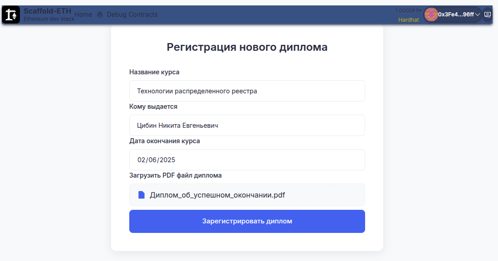
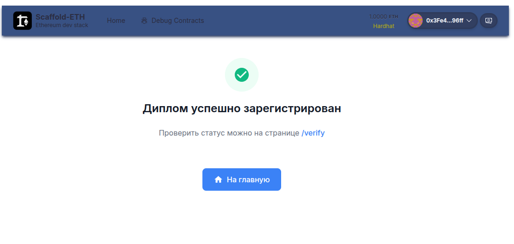
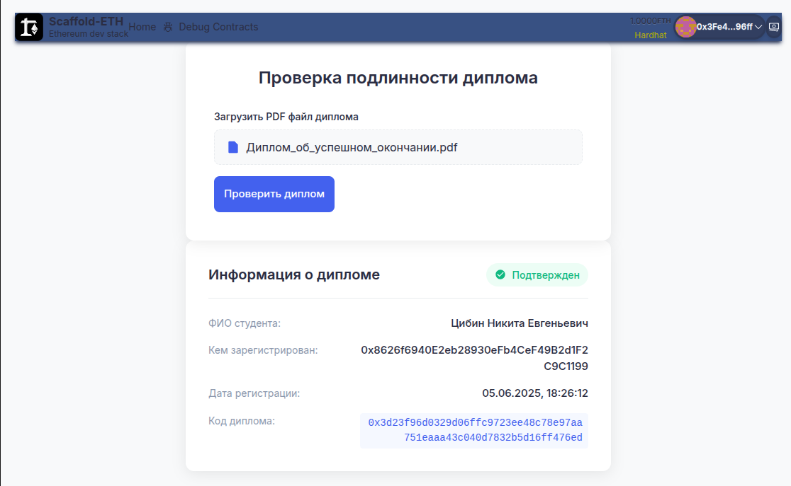

# Смарт-контракт для хранения дипломов

Работодателям предоставляют большое количество поддельных дипломов. Наш сервис помогает решить эту проблему. Подходит для онлайн школ и других образовательных организаций, работодателей и студентов.

Основано на Scaffold-ETH 2

## Запуск локально

1. Запустите локальную сеть:

```
yarn chain
```

2. Создайте файл с переменными окружения `.env.local`

3. В другом терминале задеплойте контракт:

```
yarn deploy
```

4. Запустить приложение:

```
yarn start
```

Откройте `http://localhost:3000`.


## Документация

Вы можете:
- Проверить подлинность диплома в pdf формате
- Зарегистрировать свой диплом, если у вас есть статус образовательной организации и админы подключили вас к сети

`/register` - регистрация диплома




❗**Важно!** Для регистрации диплома нужно установить расширение MetaMask и подключить его к сети




`/verify` - проверка диплома


